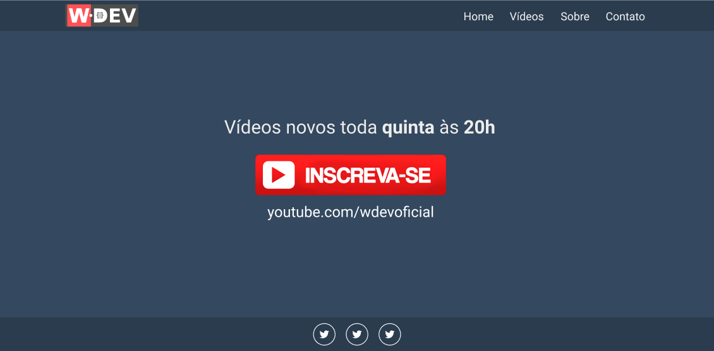

<h1 align="center">
  
</h1>

<h3 align="center">
  Criando um site institucional utilizando Axios + Vue.js
</h3>

<p align="center">
  <a href="https://www.youtube.com/watch?v=kmsM_hHrDHE">
    Tutorial
  </a>
</p>

<p align="center">Por William Costa - WDEV</p>

<p align="center">
  <a href="#como-executar-o-projeto">Como executar o projeto
</p>

<p align="center">Front-end</p>

<p align="center">
  
</p>

## Como executar o projeto

### Requisitos

- [Node.js](https://nodejs.org)

### Clonar este repositório

```bash
git clone https://github.com/eliasmcastro/wdev-youtube-site-institucional-vuejs.git
```

### Back-end

Vamos utilizar uma fake API para prover os dados, para isso entre na pasta backend e execute

- `npm install` para instalar as dependências do projeto
- `npm run serve` para iniciar a API fake

As rotas disponíveis são:

- http://localhost:3333/social-links
- http://localhost:3333/videos
- http://localhost:3333/about
- http://localhost:3333/contacts

### Front-end

Para executar o front-end, entre na pasta frontend e execute

- `npm install` para instalar as dependências do projeto
- `npm run serve` para iniciar o servidor de desenvolvimento
- Acessar http://localhost:8080
